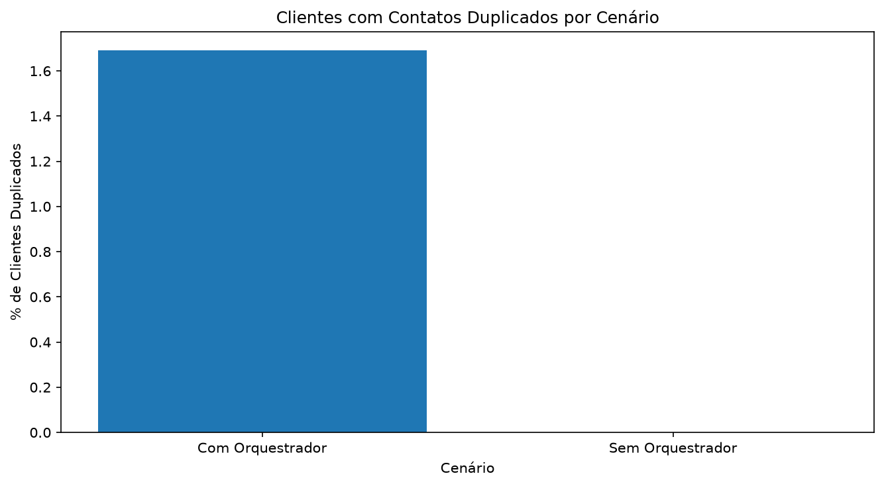
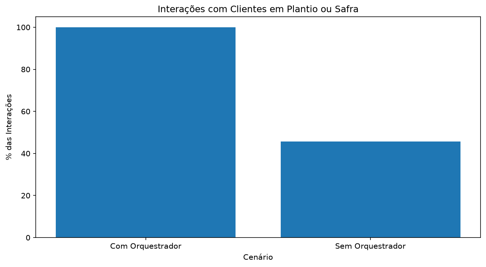
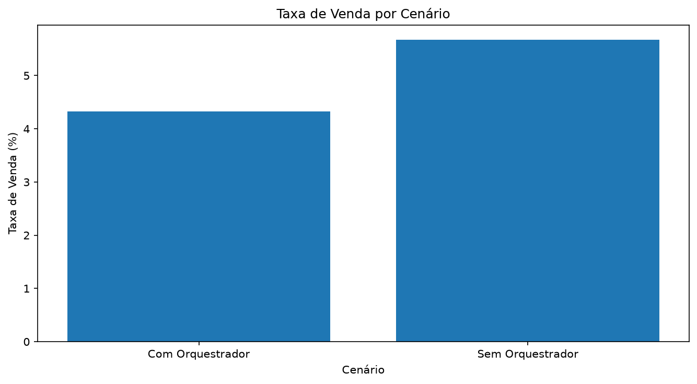
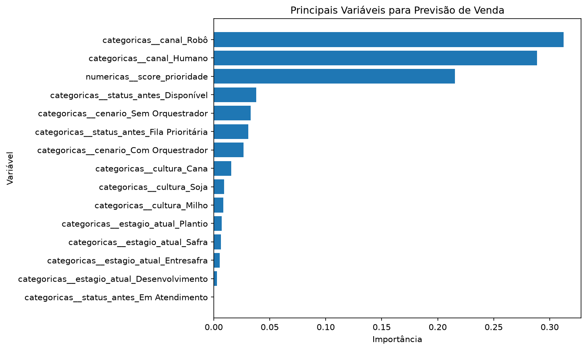

# Agro Leads Orchestrator

Projeto profissional de dados desenvolvido para simular, analisar e otimizar uma operação comercial omnichannel no setor agrícola.

O projeto representa uma empresa de insumos, máquinas ou serviços agrícolas que possui uma grande base de leads e utiliza diferentes canais de contato, como vendedores humanos, robôs de ligação e WhatsApp.

O problema central é a falta de orquestração entre os canais, o que pode gerar contatos duplicados, baixa produtividade comercial, atrito com clientes e perda de oportunidades.

---

## Objetivo do Projeto

O objetivo deste projeto é construir uma solução ponta a ponta usando Python, SQL, análise de dados, regras de negócio, simulação operacional e Machine Learning.

A solução propõe um orquestrador de leads capaz de:

- controlar o status dos clientes;
- evitar contatos duplicados;
- aplicar cooldown após não atendimento;
- priorizar clientes que respondem via WhatsApp;
- simular transferência assistida entre robô e vendedor;
- registrar eventos auditáveis;
- criar score de prioridade comercial;
- analisar resultados por meio de indicadores;
- aplicar Machine Learning para prever chance de conversão.

---

## Problema de Negócio

Em uma operação comercial agrícola com alto volume de leads, diferentes canais podem tentar contato com o mesmo cliente sem coordenação centralizada.

Exemplo do problema:

- um robô liga para o cliente;
- o cliente não atende;
- pouco tempo depois, um vendedor humano também liga;
- em paralelo, o WhatsApp envia uma mensagem;
- o cliente se sente incomodado;
- a empresa perde eficiência e pode prejudicar o relacionamento comercial.

Esse tipo de problema é comum em operações comerciais com múltiplos canais e grande volume de dados.

---

## Solução Proposta

A solução criada neste projeto é um **Orquestrador Omnichannel de Leads Agrícolas**, baseado em uma máquina de estados.

Cada lead pode assumir um dos seguintes status:

| Status | Descrição |
|---|---|
| Disponível | Lead apto para contato |
| Em Cooldown | Lead temporariamente bloqueado após não atendimento |
| Fila Prioritária | Lead que respondeu WhatsApp e deve ser priorizado |
| Em Atendimento | Lead em atendimento humano ou transferência assistida |
| Convertido | Lead que realizou compra e sai temporariamente da régua comercial |

---

## Regras de Negócio

As principais regras implementadas foram:

- se o cliente não atende, entra em cooldown por 48 horas;
- durante o cooldown, robôs e vendedores não devem ligar novamente;
- se o cliente responde ao WhatsApp, entra em fila prioritária;
- se o robô consegue contato, ocorre transferência assistida para vendedor humano;
- se ocorre venda, o lead fica bloqueado por 30 dias;
- clientes em Plantio ou Safra recebem maior prioridade no score;
- todos os eventos são registrados em histórico auditável.

---

## Arquitetura do Projeto

O projeto foi organizado em camadas, separando notebooks de análise dos módulos de código reutilizáveis.

```text
agro-leads-orchestrator/
│
├── notebooks/
│   ├── 01_configuracao_projeto.ipynb
│   ├── 02_engenharia_dados.ipynb
│   ├── 03_analise_exploratoria.ipynb
│   ├── 04_state_machine.ipynb
│   ├── 05_simulador_operacao.ipynb
│   ├── 06_machine_learning.ipynb
│   └── 07_dashboard_final.ipynb
│
├── src/
│   ├── banco.py
│   ├── gerador.py
│   ├── score.py
│   ├── estatisticas.py
│   ├── visualizacao.py
│   ├── orquestrador.py
│   ├── simulador.py
│   ├── modelagem.py
│   └── dashboard.py
│
├── dados/
├── outputs/
├── img/
├── docs/
├── README.md
├── requirements.txt
└── .gitignore
```

---

## Tecnologias Utilizadas

- Python
- Pandas
- NumPy
- SQLite
- SQL
- Matplotlib
- Scikit-learn
- Jupyter Notebook
- Git e GitHub
- Machine Learning
- Engenharia de Dados
- Análise Exploratória de Dados
- Simulação Operacional

---

## Etapas do Projeto

| Notebook | Etapa | Descrição |
|---|---|---|
| 01 | Configuração do Projeto | Criação do banco SQLite, schema, geração de leads sintéticos e índices |
| 02 | Engenharia de Dados | Validação, estatísticas, nulos, duplicidades e criação de features |
| 03 | Análise Exploratória | Análise de cultura, estágio agrícola, status e score |
| 04 | State Machine | Implementação das regras de negócio e transições de status |
| 05 | Simulador Operacional | Comparação entre operação sem e com orquestrador |
| 06 | Machine Learning | Modelo para prever chance de conversão |
| 07 | Dashboard Final | Consolidação dos indicadores e resumo executivo |

---

## Modelo de Dados

O projeto utiliza duas tabelas principais no SQLite:

### Tabela `leads`

Contém a base principal de clientes e informações comerciais.

Principais campos:

- `id_cliente`
- `nome`
- `telefone`
- `cultura`
- `estagio_atual`
- `status_atual`
- `ultimo_contato`
- `cooldown_ate`
- `score_prioridade`

### Tabela `eventos_contato`

Registra o histórico auditável das interações.

Principais campos:

- `id_evento`
- `id_cliente`
- `data_evento`
- `canal`
- `resultado`
- `observacao`

---

## Simulação Operacional

Foram comparados dois cenários:

### Cenário 1 — Sem Orquestrador

Neste cenário, os contatos ocorrem sem controle centralizado, permitindo que o mesmo cliente seja acionado mais de uma vez no mesmo período.

### Cenário 2 — Com Orquestrador

Neste cenário, a máquina de estados controla as regras operacionais, impedindo contatos indevidos e priorizando clientes com maior potencial.

---

## Indicadores Gerados

O projeto gera indicadores como:

- percentual de clientes com contatos duplicados;
- taxa de venda por cenário;
- taxa de não atendimento;
- percentual de interações em momento agrícola crítico;
- quantidade de eventos auditáveis;
- desempenho dos modelos de Machine Learning;
- importância das variáveis para previsão de venda.

---

## Resultados Visuais

### Contatos Duplicados por Cenário



---

### Interações em Momento Agrícola Crítico



---

### Taxa de Venda por Cenário



---

### Importância das Variáveis no Modelo



---

## Machine Learning

Na etapa de Machine Learning, foram treinados modelos de classificação para prever se uma interação comercial teria maior chance de resultar em venda.

Modelos utilizados:

- Regressão Logística;
- Random Forest.

A variável alvo criada foi:

| Variável | Descrição |
|---|---|
| `converteu` | 1 para venda, 0 para demais resultados |

Variáveis explicativas utilizadas:

- cenário;
- canal;
- cultura;
- estágio agrícola;
- status anterior;
- score de prioridade.

Como a base é sintética e gerada por regras de negócio, os resultados devem ser interpretados como demonstração técnica de pipeline de modelagem, e não como modelo produtivo real.

---

## Principais Aprendizados

Este projeto demonstra competências em:

- construção de banco de dados relacional;
- criação de dados sintéticos realistas;
- modelagem de regras de negócio;
- uso de SQL com Python;
- engenharia de dados;
- análise exploratória;
- simulação operacional;
- machine learning supervisionado;
- avaliação de modelos;
- storytelling com dados;
- organização profissional de projeto para GitHub.

---

## Como Executar o Projeto

Clone o repositório:

```bash
git clone https://github.com/imarques-codes/agro-leads-orchestrator.git
```

Acesse a pasta:

```bash
cd agro-leads-orchestrator
```

Crie o ambiente virtual:

```bash
python -m venv .venv
```

Ative o ambiente virtual no Windows:

```bash
.\.venv\Scripts\Activate.ps1
```

Instale as dependências:

```bash
pip install -r requirements.txt
```

Execute os notebooks na ordem:

```text
01_configuracao_projeto.ipynb
02_engenharia_dados.ipynb
03_analise_exploratoria.ipynb
04_state_machine.ipynb
05_simulador_operacao.ipynb
06_machine_learning.ipynb
07_dashboard_final.ipynb
```

---

## Observações

Os arquivos de banco SQLite e saídas intermediárias não são versionados no GitHub por boas práticas de projeto.

Arquivos ignorados:

- `.venv/`
- bancos `.db`;
- arquivos temporários;
- outputs gerados localmente.

---

## Conclusão

O **Agro Leads Orchestrator** demonstra como dados, regras de negócio e Machine Learning podem ser combinados para resolver um problema operacional real em uma operação comercial agrícola.

O projeto vai além de uma análise exploratória simples. Ele apresenta uma solução completa, com geração de dados, banco SQL, camada de orquestração, simulação, modelagem preditiva e dashboard executivo.

